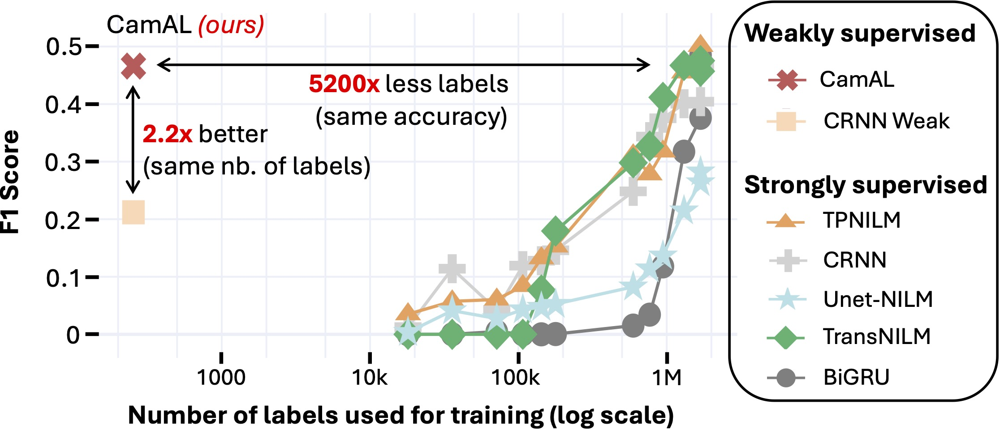
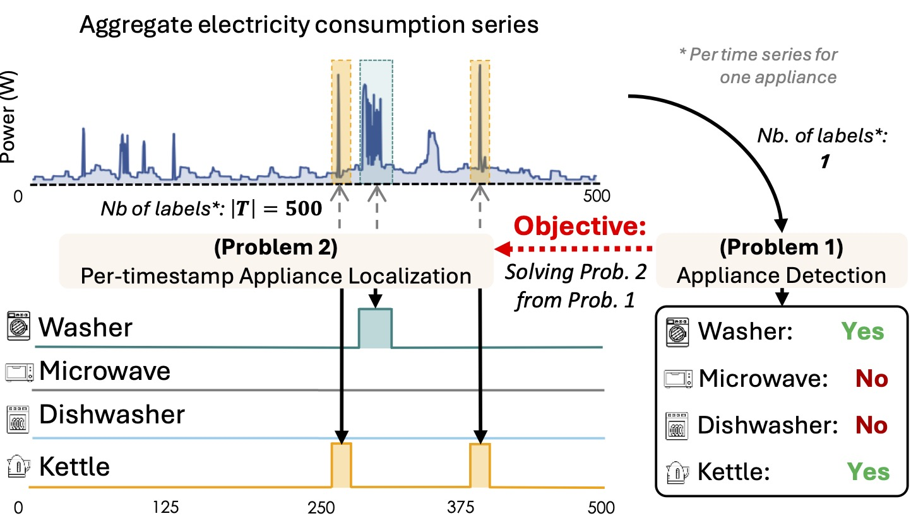
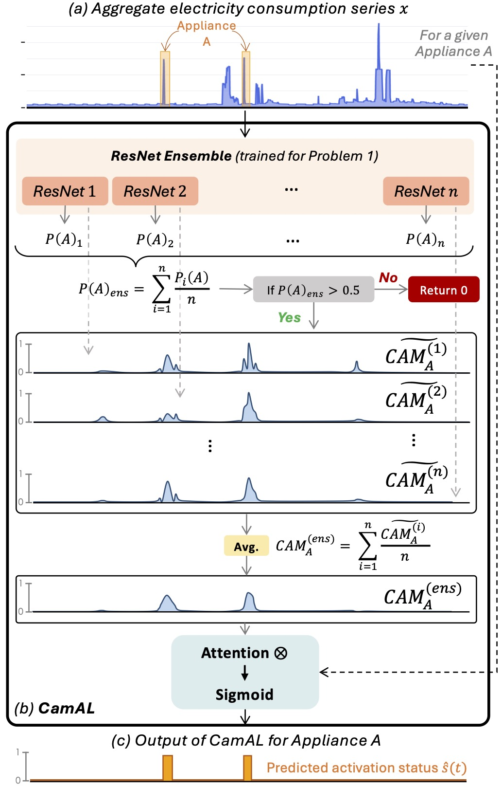
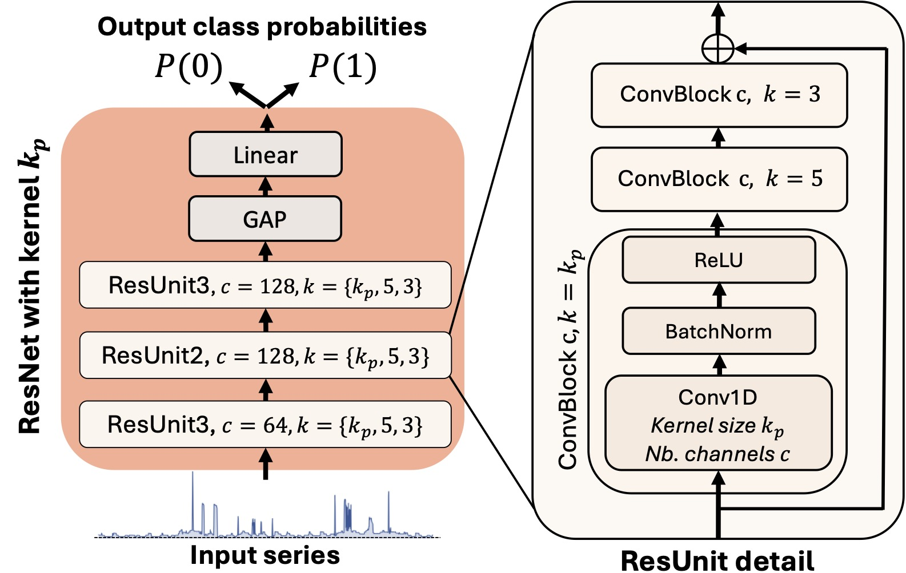

# CamaL

Official codebase implementation for **Few Labels are all you need: A Weakly Supervised Framework for Appliance Localization in Smart-Meter Series**

<p align="center">

</p>

Improving smart grid system management is crucial in the fight against climate change, and enabling consumers to play an active role in this effort is a significant challenge for electricity suppliers. 
In this regard, millions of smart meters have been deployed worldwide in the last decade, recording the main electricity power consumed in individual households.
This data produces valuable information that can help them reduce their electricity footprint; nevertheless, the collected signal aggregates the consumption of the different appliances running simultaneously in the house, making it difficult to apprehend.
**Non-Intrusive Load Monitoring (NILM)** refers to the challenge of estimating the power consumption, pattern, or on/off state activation of individual appliances using the main smart meter signal.
Recent methods proposed to tackle this task are based on a fully supervised deep-learning approach that requires both the aggregate signal and the ground truth of individual appliance power.
However, such labels are expensive to collect and extremely scarce in practice, as they require conducting intrusive surveys in households to monitor each appliance.
We introduce CamAL, a weakly supervised approach for appliance pattern localization that only requires information on the presence of an appliance in a household to be trained.


## Outline 📝

This repository contains the **source code** of CamAL, as well as the code needed to reproduce the experimental evaluation from our paper.  

Overall our repo contains the following elements:
- [Expes](https://github.com/adrienpetralia/CamAL/tree/main/Expes): Script to run our experiments for each dataset
- [Configs](https://github.com/adrienpetralia/CamAL/tree/main/Configs): Config files for our experimental evaluation
- [Helpers](https://github.com/adrienpetralia/CamAL/tree/main/Helpers): Preprocessing and Postprocessing functions
- [Models](https://github.com/adrienpetralia/CamAL/tree/main/Models): CamAL code and other state of the art implementations

---

### Getting Started 🚀

To install the dependencies, you can use the following commands. Life is much easier thanks to [uv](https://astral.sh/blog/uv)!

```bash
pip install uv
git clone https://github.com/adrienpetralia/CamAL.git
cd CamAL
uv sync
```


### Code Structure 📁

```
.
├── assets                 # assets for the README file 
├── configs                # configs folder (i.e., '.yaml' files)
├── data                   # data info folder
├── scripts                # scripts to launch experiments
│   ├── run_one_expe.py    #   python script to launch one experiment
│   └── run_all_expe.sh    #   bash script to launch all experiments
├── src                    # source package
│   ├── helpers            #   helper functions (processing, training loops, metrics, ...)
│   ├── baselines          #   nilm baselines
│   └── camal              #   camal model
├── pyproject.toml         # project setup file
└── uv.lock                # lock to resolve dependencies
```

### Launch an Experiment ⚙️


## CamAL in Short

our proposed approach, CamAL, enables the detection and localization of appliance patterns in aggregated consumption series.
CamAL can be decomposed into two parts: (1) an ensemble of deep-learning classifiers that performs the detection and (2) an explainability-based module that localizes the appliance (when detected).
The ensemble of deep learning classifiers is based on different Convolutional ResNet architectures with varying kernel sizes.
In simple words, the explainability-based module can be described as extracting the CAM of all the different classifier of the ensemble and using it as an attention mask to highlight the parts of the input sequence that contribute the most to the decision.

### Appliance Detection vs Localization

Before getting into the details of how our methods work, we have to define properly the problems we aim to solve.
A smart meter signal is a univariate time series $x = (x_1, ..., x_T)$ of $T$ timestamped power consumption readings. 
The meter reading is defined as the time difference $\Delta_t = t_{i} - t_{i-1}$ between two consecutive timestamps $t_i$. 
Each element $x_t$ (in Watts or Watt-hours) represents either the actual power at time $t$ or the average power over the interval $\Delta_t$.

The aggregate power consumption is defined as the sum of  $N$ appliance power signal $a_1(t), a_2(t), \ldots, a_N(t)$ that run simultaneously plus some noise $\epsilon(t)$, accounting for measurement errors. 
Formally, it is defined as:

$$
x(t)=\sum^{N}_{i=0} a_j(t) + \epsilon(t)
$$

where $x(t)$ is the total power consumption measured by the main meter at timestep $t$; $N$ is the total number of appliances connected to the smart meter; and $\epsilon(t)$ is defined as the noise or the measurement error at timestep $t$.

<p align="center">

</p>

Practitioners are interested in solving two problems: (i) discovering *if* an appliance has been activating (Appliance detection problem), and (ii) identifying *when* an appliance has been used (Per-Timestamp Appliance Localization Problem). The two problems are formalized as follows:

#### Problem 1: Appliance Detection
Given an aggregate consumption smart meter series $\boldsymbol{x} = \bigl(\mathbf{x}_{t_1},\mathbf{x}_{t_2},\,\ldots,\mathbf{x}_{t_T}\bigr) \in \mathbb{R}^+_{T}$, an appliance $a$, we want to know if $a$ has been used in $\boldsymbol{x}$ (i.e., was in an "ON" state, regardless of the time and number of activations). 

#### Problem 2: Per-timestamp Appliance Localizaton
The total active power consumed in a household is denoted by $x(t)$, the active power of the $n$-th appliance by $a_n(t)$, and its state by $s_n(t) \in \{0, 1\}$. Then we have:

$$
x(t) = \sum_{n=1}^{N} s_n(t)a_n(t) + \varepsilon(t)
$$

where $\varepsilon(t)$ represents the measurement noise, and:

$$
s_n(t) = 
\begin{cases} 
0, & \text{if appliance } n \text{ is OFF at time index } t,\\
1, & \text{if appliance } n \text{ is ON at time index } t.
\end{cases}
$$

We want to compute the consumption (or activation) of appliance $n$, $a_n(t)$, from $x(t)$. 
In order to solve Problem 2, we can rewrite the equation above as: 

$$
x(t) = s(t)a(t) + v(t),
$$

where the first term is the power of the appliance of interest, and $v(t)$ is a cumulative noise term corresponding to the sum of all the other appliances running simultaneously.

In cases where the objective is the direct estimation of the individual active power signal $a(t)$, NILM is treated as a regression problem and has been approached either as a denoising task or as a blind source separation task. 
Conversely, when the objective is to estimate the appliance state $s(t)$, NILM represents a classification problem. 
In both cases, the algorithm utilizes only the knowledge of the aggregate signal $x(t)$.
This work focuses on appliance status detection, aiming to estimate the state variables $s(t)$ of the appliance of interest.

Note that the proposed methods to solve Problem 2 require one label per timestamp and per appliance. 
On the contrary, methods aiming to solve Problem 1, i.e. time series classifiers, require only labels indicating if an appliance has been used within a time frame.
Such labels are significantly easier to collect with non-intrusive solutions, such as asking people to answer questionnaires.
CamAL solves Problem 2 from Problem 1, therefore using labels indicating if an appliance has been used within a time frame.


### CamAL in details 🔎

As mentioned above, our proposed approach CamAL enables the detection and localization of appliance patterns in aggregated consumption series.
CamAL can be decomposed into two parts: (1) an ensemble of deep-learning classifiers that performs the detection and (2) an explainability-based module that localizes the appliance (when detected).

<p align="center">

</p>

#### Step 1: CamAL ResNets Ensemble for Problem 1

The Residual Network (ResNet) architecture was introduced to address the gradient vanishing problem encountered in large CNNs.
A ResNet architecture has been proposed for time series classification in and shown great performance on different benchmark.
The architecture is composed of 3 stacked residual blocks connected by residual connections: this means that the input of a residual block is taken and added to its output. 
Each residual block comprises 3 convolutional blocks as described in the ConvNet architecture (same kernel size $\{8, 5, 3\}$, but each layer in a block uses the same number of filters).
The three residual blocks came with respectively $\{64, 128, 128\}$ filters, and, at this end, a global average pooling is performed along the temporal dimension followed by a linear layer and a softmax activation function to perform classification.

<p align="center">

</p>

We leverage the strong proposed baseline to an ensemble of $N$ networks differing in kernel sizes within the convolutional layers.
By default, we set $N=5$.
More specifically, the ensemble is based on an ensemble of networks trained with different kernel sizes $k_p$  (with $k_p \in K_p = {5, 7, 9, 15, 25}$). 
The ResNet architecture used in our ensemble is depicted in the figure above according to a kernel size $k_p$.
This design choice is based on the intuition that varying kernel sizes change the receptive fields of the convolutional neural network (CNN), offering different levels of explainability.

#### Step 2: CAM at the rescue for Problem 2

Identifying the discriminative features that influence a classifier's decision-making process has been extensively studied. 
Using deep-learning architecture for classification tasks, different methods have been proposed to highlight (i.e., localize) the parts of an input instance that contribute the most to the final decision of the classifier.
Based on this previous work, we developed a specific method based on the CAM to localize appliance patterns in a given consumption series.
Our approach involves extracting the CAMs from all the ResNets in the trained ensemble, computing their average, and applying the resulting map as an attention mask to the input series. 
This process serves to highlight the regions in the time series that are most indicative of the appliance's operation while taking into the shape of the aggregate signal to better localize the exact appliance activation time.

##### ResNet Ensemble Prediction
An aggregated input sequence $\mathbf{x}$ is fed into the ensemble of ResNet models. 
Each model predicts the probability of detection that the appliance $a$ is present in $\mathbf{x}$. 
Then, the ensemble prediction probability is computed as the average of individual model probabilities:

$$
\text{Prob} _ {\text{ens}} = \frac{1}{N} \sum_{n=1}^N \text{Prob}_n
$$

where $N$ is the number of models in the ensemble, and $\text{Prob}_n$ is the prediction from the $n$-th model.

##### Appliance Detection
If the ensemble probability exceeds a threshold (e.g., $\text{Prob}_{\text{ens}} > 0.5$), the appliance is considered detected in the current window.
Otherwise, the appliance is undetected, and the activation status (i.e., localization) is set to 0 for each timestamp.

##### CAM Extraction
If the appliance $a$ is detected, we extract each ResNet's CAM for class 1. 
As introduced before, for univariate time series, the CAM for class $c$ at timestamp $t$ is defined as:

$$
\text{CAM}^i_{c=1}(t) = \sum_{k} w_k^{c=1} \cdot f_k(t),
$$

where $w_k^c$ are the weights associated with the $k$-th filter for class $c$, and $f_k(t)$ is the activation of the $k$-th feature map at time $t$ for the CAM that correspond to the $i$-th ResNet in the ensemble.

##### CAM processing
Each $\text{CAM}^{(i)}$ is normalized to the range $[0, 1]$ by dividing it not the maximum value reached. Then, the average of each extracted CAM of the ensemble is computed as follows:

$$
\text{CAM} _ {\text{ens}}(t) = \frac{1}{N} \sum_{n=1}^N \widetilde{\text{CAM}}^{(i)}(t).
$$

##### Attention Mechanism
$\text{CAM}_{avg}$ serves as an attention mask, highlighting the ensemble decision for each timestamp. 
We apply this mask to the input sequence through point-wise multiplication and pass the results through a sigmoid activation function to map the values in $[0,1]$: 

$$
\mathbf{s}(t) = \text{Sigmoid}(\text{CAM}_{\text{ens}}(t) \circ \mathbf{x}(t)).
$$

##### Appliance Status
The obtained signal is then rounded to obtain binary labels ($1$ if $s(t) \geq 0.5$), indicating the appliance's status at each timestamp and resulting in a binary time series $\hat{s}(t)$.


##### From Binary Labels to Consumption per Appliances

To estimate the individual power consumption $\(\hat{p}_a(t)\)$ of an appliance $\(a\)$ using the predicted status signal $\(\hat{s}(t)\)$ from CamAL, we employ a straightforward method. 
First, we multiply the binary status signal $\(\hat{s}(t)\)$ where $\(\hat{s}(t) = 1\)$ by the mean power consumption $\(P_a\)$ of the appliance (this parameter can be inferred from the dataset or provide by expert) as follows:

$$
\hat{p}_a^\text{initial}(t) = \hat{s}(t) \cdot P_a
$$

Then, to ensure that the estimated individual power consumption does not exceed the total aggregate power consumption at any given time $\(t\)$, we apply a clipping operation that aims to adjust the estimated power so that it is always less than or equal to the observed aggregate consumption $\(x(t)\)$:

$$
\hat{p}_a(t) = \min\left( \hat{p}_a^\text{initial}(t), \, x(t) \right)
$$


## Contributors 👨‍👨‍👦‍👦

* Adrien Petralia (Université Paris Cité, EDF Research)
* Paul Boniol (Inria, ENS)
* Philippe Charpentier (EDF Research)
* Themis Palpanas (IUF, Université Paris Cité,) 


## Acknowledgments 🎅

Work supported by EDF R&D and ANRT French program.


