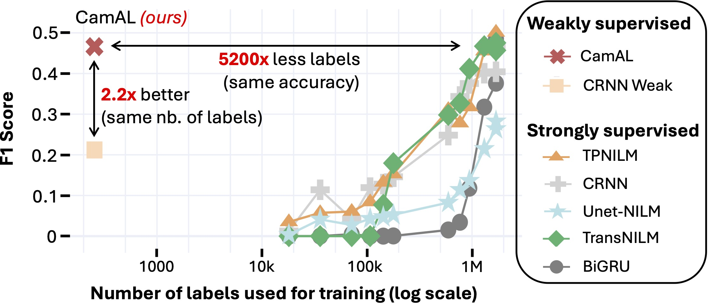
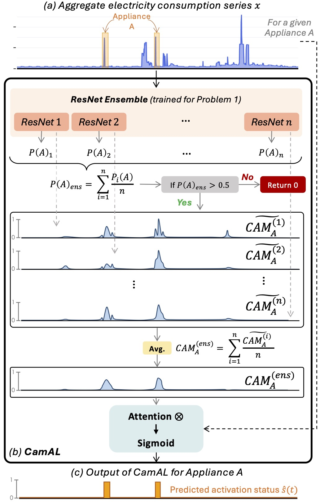

# CamAL

<div align="center">

[](https://arxiv.org/abs/2506.05895)
[]()

</div>

Official codebase implementation for **Few Labels are all you need: A Weakly Supervised Framework for Appliance Localization in Smart-Meter Series** (IEEE ICDE 2025).

📄 **Arxiv preprint**: [CamAL](https://arxiv.org/abs/2506.05895)

<p align="center">

</p>

Reducing household electricity consumption is key in the fight against climate change, and smart meters help by recording aggregate power usage. Non-Intrusive Load Monitoring (NILM) aims to infer individual appliance usage (on/off states or power) from this aggregate signal. While existing deep-learning methods need timestamp-level ground truth for every appliance, **CamAL** only needs coarse labels indicating whether an appliance was used at all—drastically cutting down labeling costs.


## Outline 📝

This repository contains the **source code** of CamAL, as well as the code needed to reproduce the experimental evaluation from our paper.  

---

### Getting Started 🚀

To install the dependencies, you can use the following commands. Life is much easier thanks to [uv](https://astral.sh/blog/uv)!

```bash
pip install uv
git clone https://github.com/adrienpetralia/CamAL.git
cd CamAL
uv sync
```


### Code Structure 📁

```
.
├── assets                 # assets for the README file 
├── configs                # configs folder (i.e., '.yaml' files)
├── data                   # data info folder
├── scripts                # scripts to launch experiments
│   ├── run_one_expe.py    #   python script to launch one experiment
│   └── run_all_expe.sh    #   bash script to launch all experiments
├── src                    # source package
│   ├── helpers            #   helper functions (processing, training loops, metrics, ...)
│   ├── baselines          #   nilm baselines
│   └── camal              #   camal model
├── pyproject.toml         # project setup file
└── uv.lock                # lock to resolve dependencies
```

### Launch an Experiment ⚙️


## CamAL

CamAL enables appliance **detection** (has an appliance been used at all?) and **localization** (exactly when was it used?) in aggregate consumption data—using only minimal labels.

### Appliance Detection vs. Localization

<p align="center">

</p>

- **Appliance Detection (Problem 1):** Determine if an appliance is active within a given period. Only coarse labels are needed (whether the appliance was used at all).
- **Per-Timestamp Localization (Problem 2):** Pinpoint which timestamps the appliance is active. Traditional methods require full timestamp-level ground truth, which is expensive. CamAL sidesteps this by leveraging the ensemble’s CAMs to localize usage from only coarse labels.


### Method Overview

<p align="center">

</p>

1. **Detection (ResNets Ensemble):**  
   Multiple ResNet classifiers (each with a different kernel size) predict whether an appliance appears in a time window. Their probabilities are averaged for a final detection score.

2. **Localization (CAM-based):**  
   If the ensemble detects the appliance, we extract Class Activation Maps (CAMs) from each ResNet, average them, and apply the result as an attention mask. This highlights the appliance’s on/off states in the time series. (Optional) Multiply these binary states by an appliance’s average power and clip by the total consumption to estimate per-appliance power.

## Citing CamAL 📚

If you use CamAL in your work, please cite our paper:

```bibtex
@inproceedings{petralia2025camal,
author = {Petralia, Adrien and Boniol, Paul and Charpentier, Philippe and Palpanas, Themis},
booktitle = {2025 IEEE 41st International Conference on Data Engineering (ICDE)},
title = {Few Labels are All You Need: A Weakly Supervised Framework for Appliance Localization in Smart-Meter Series},
year = {2025},
doi = {10.1109/ICDE65448.2025.00329},
publisher = {IEEE Computer Society},
}
```

## Contributors 👨‍👨‍👦‍👦

* Adrien Petralia (Université Paris Cité, EDF Research)
* Paul Boniol (Inria, ENS)
* Philippe Charpentier (EDF Research)
* Themis Palpanas (IUF, Université Paris Cité,) 


## Acknowledgments 🎅

Work supported by EDF R&D and ANRT French program.


